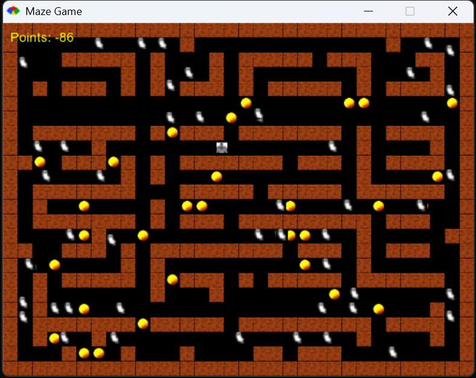
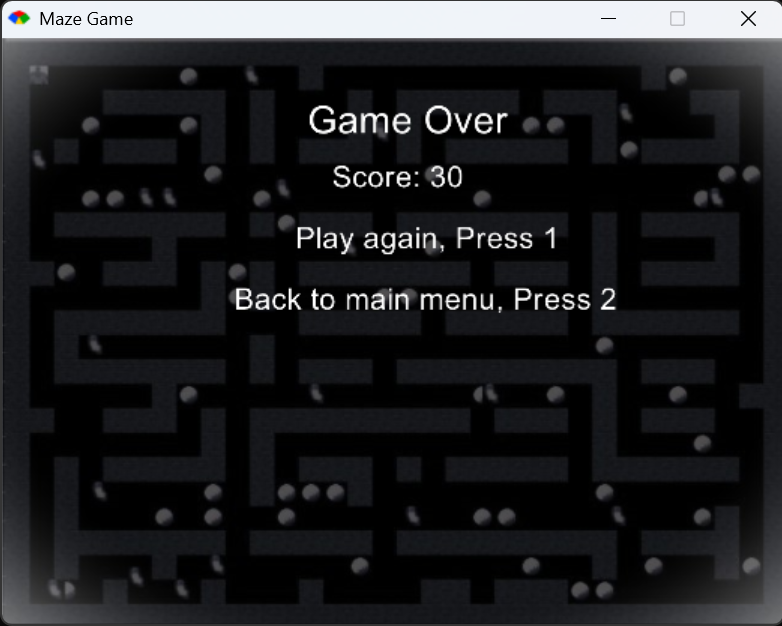

# Maze Runner Game

Maze Runner is a 2D game developed as part of the **Intro to Programming** unit during my first semester, which started in February 2024. This project showcases my ability to independently learn new technologies, apply programming principles, and bring a concept to life using the **Ruby** programming language and the **Gosu** game development library. 

From conceptualizing the idea to implementing mechanics and visuals, this game reflects my growth as a developer and my drive to take on challenges that push the boundaries of my knowledge and skills.

---

## Features

- **Player Movement:**  
  Control the player using keyboard arrow keys to navigate the maze. 
- **Walls and Maze Layout:**  
  The maze structure is defined using a grid, where players cannot pass through walls.
- **Enemies:**  
  Enemies dynamically move around based on the difficulty level selected (easy, medium, hard).  
- **Coins:**  
  Collect coins scattered across the maze to increase your score. 
- **Difficulty Levels:**  
  Choose between three difficulty levels, which affect the number and behavior of enemies.  
- **Game States:**  
  Seamless transitions between the main menu, gameplay, and the game-over screen.  
- **Graphics:**  
  Custom assets for player characters, enemies, walls, coins, and UI elements.
- **Screenshots:**  
  A visual representation of the gameplay at different stages:
  - **Game Start (Choose Difficulty & Instructions):**  
    
  - **Gameplay Screen (Maze Layout):**  
    
  - **Game Over Screen:**  
    

---

## Technologies Used

- **Ruby:**  
  A flexible and beginner-friendly programming language.  
- **Gosu:**  
  A Ruby library for 2D game development, providing tools for graphics, sound, and input handling.  
- **Image Assets:**  
  Custom graphics for various game objects like walls, enemies, and the player.

---

## Code Structure

- **`game_window.rb`:**  
  The main file containing the game loop and logic for rendering and interactions.  
- **Classes:**  
  - **Player Class:** Manages player attributes, controls, and movement.  
  - **Enemy Class:** Handles enemy behavior and interaction with the maze.  
  - **Wall Class:** Represents the solid walls in the maze.  
  - **Coin Class:** Handles collectible coin behavior.  
- **Maze Layout:**  
  A 2D grid array defines the game environment. `1` represents walls, and `0` represents walkable paths.  
- **Game States:**  
  Includes logic for the main menu, gameplay, and game-over screen to ensure smooth transitions and flow.  

---

## How to Run the Game

To play Maze Runner on your local machine, follow these steps:

1. **Install Ruby:**  
   - Download and install Ruby from [ruby-lang.org](https://www.ruby-lang.org).  
   - Verify the installation by running:  
     ```bash
     ruby -v
     ```

2. **Install the Gosu Library:**  
   - Install the Gosu gem using the following command:  
     ```bash
     gem install gosu
     ```

3. **Clone the Repository:**
   - Clone this repository to your local machine or download the files as a ZIP archive.

4. **Run the Game:**
   - Navigate to the directory where the game files are located.
   - Run the game using the following command:
     ```bash
     ruby game_window.rb
     ```

## Challenges & Learning Experience

- **Building the Idea Independently:** I came up with the idea for this game and built it myself, from creating the basic layout to implementing the game mechanics. This project helped me apply my knowledge of programming concepts like logic, control flow, and object-oriented programming.
- **Learning Ruby and Gosu:** Ruby was new to me, and I had to learn it quickly to bring my idea to life. The Gosu library was also unfamiliar, but I managed to learn its basics within a short time to implement key features like movement, collision detection, and rendering.
- **Problem Solving:** Developing the game required me to think critically and solve problems around how different game elements (player, enemies, walls) interact with each other. I also worked on optimizing the maze generation and improving the user experience.

---

Thank you for checking out my **Maze Runner Game**. This project marks an important milestone in my programming journey, where I learned a lot about both coding and game development.

