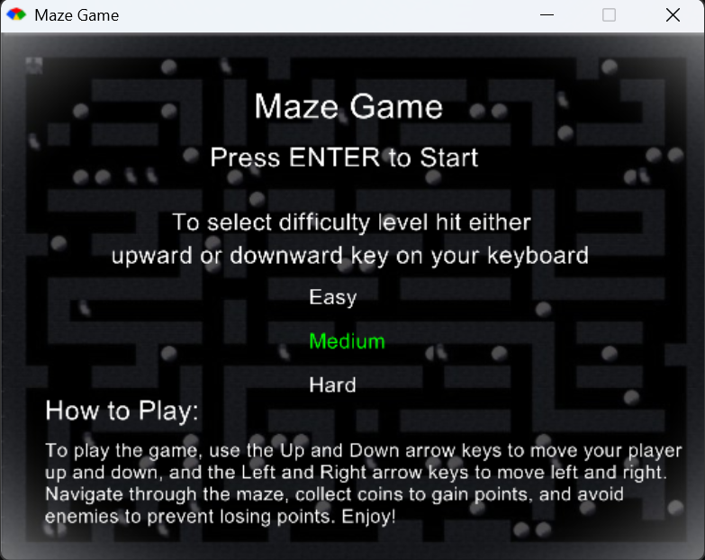

# Maze Runner Game

Maze Runner is a 2D game developed as part of a task for the **Intro to Programming** unit during my **first semester**, which started in **February 2024**. This project showcases my ability to independently learn new technologies, apply programming principles, and bring a concept to life using the **Ruby** programming language and the **Gosu** game development library. 

From conceptualizing the idea to implementing mechanics and visuals, this game reflects my growth as a developer and my drive to take on challenges that push the boundaries of my knowledge and skills.

---

## Features

- **Player Movement:** Use arrow keys to navigate the maze. 
- **Maze Layout & Walls:** Defined grid where walls block movement.
- **Enemies:** Move based on selected difficulty (easy, medium, hard).
- **Coins:** Collect coins for score boosts. 
- **Difficulty Levels:** Adjust enemy numbers and behavior.
- **Game States:** Main menu, gameplay, and game-over screens.
- **Graphics:** Custom assets for player, enemies, walls, coins.
- **Screenshots:**  
  A visual representation of the gameplay at different stages:
  - **Game Start (Choose Difficulty & Instructions):**  
    
  - **Gameplay Screen (Maze Layout):**  
    
  - **Game Over Screen:**
    

---

## Technologies Used

- **Ruby:**  
  A flexible and beginner-friendly programming language.  
- **Gosu:**  
  A Ruby library for 2D game development, handling graphics, sound, and input.  

---

## Code Structure

- **`main.rb`:**  
  The main file containing the game loop and logic for rendering and interactions.  
- **Classes:**  
  - **Player Class:** Manages player attributes, controls, and movement.  
  - **Enemy Class:** Handles enemy behavior and interaction with the maze.  
  - **Wall Class:** Represents the solid walls in the maze.  
  - **Coin Class:** Handles collectible coin behavior.  
- **Maze Layout:**  
  A 2D grid array defines the game environment. `1` represents walls, and `0` represents walkable paths.  
- **Game States:**  
  Includes logic for the main menu, gameplay, and game-over screen to ensure smooth transitions and flow.  

---

## How to Run the Game

To play Maze Runner on your local machine, follow these steps:

1. **Install Ruby:**  
   - Download and install Ruby from [ruby-lang.org](https://www.ruby-lang.org).  
   - Verify the installation by running:  
     ```bash
     ruby -v
     ```

2. **Install the Gosu Library:**  
   - Install the Gosu gem using the following command:  
     ```bash
     gem install gosu
     ```

3. **Clone the Repository:**
   - Clone this repository to your local machine or download the files as a ZIP archive.

4. **Run the Game:**
   - Navigate to the directory where the game files are located.
   - Run the game using the following command:
     ```bash
     ruby main.rb
     ```

## Challenges & Learning Experience

This project involved independently building the game from concept to execution, applying programming concepts like logic, control flow, and object-oriented programming (OOP). Learning Ruby and Gosu was a valuable experience as I quickly grasped their features to implement key mechanics such as player movement, collision detection, and game states. I also focused on solving problems related to maze generation, optimizing gameplay, and improving user experience.

If I had more time, I would have added features like randomizing the maze for more challenge, integrating audio, and allowing players to choose their characters or enemies.

---


